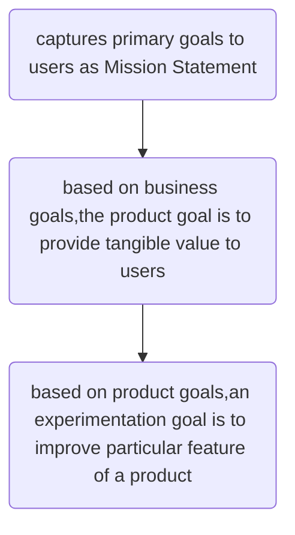

Define the goal of experiment. 

Hierarchy of goals to consider - When we run a experiment to improve quality of thr product contributing to growth of the business. 

Example: 

Business --> Product --> Experimentation 

Apple as a product 

Business : 
     -- Mission Statement - "Bringing best user experience for users with best innovative software, hardware & services"

Product : 
     -- Iphone - smartphone for contact, work and photos
     -- Ipad - easy to use smart tablet for work & entertainment
     -- Apple Music - streaming service to provide accessibility for millions of songs

Experimentation : 
     -- Iphone - Facial recognition to unlock phone / AI generated text message or photo edits
     -- Ipad - Better hand gestures to improve user enagagement for typing/ deleting texts
     -- Apple Music - Launch personalised music package marketing strategy to improve growth

     
