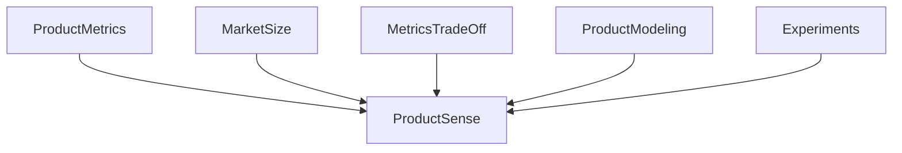

PRODUCT SENSE BASICS 

Need to understand current user path in order to acheive and feel what a user is experiencing to know the pain points of users.

Once when we know that we can easliy solve the problem with various strategies. 

These are elements we need to consider for product sense .

- Product Metrics - Defining KPIs for the given product. 
- Market size - gage how many users are going to use the product before launching.
- Metrics Trade Off - After launching - if one metric is gone up and other gone down, what kind of deicision we need to make for such trade off. 
- Product Modeling - invloves ML Algo for better user experience like recommendation system.
- Experiments - When we have various versions and variations in product, need to run an a/b experiment to know whihc product is better for users. 

