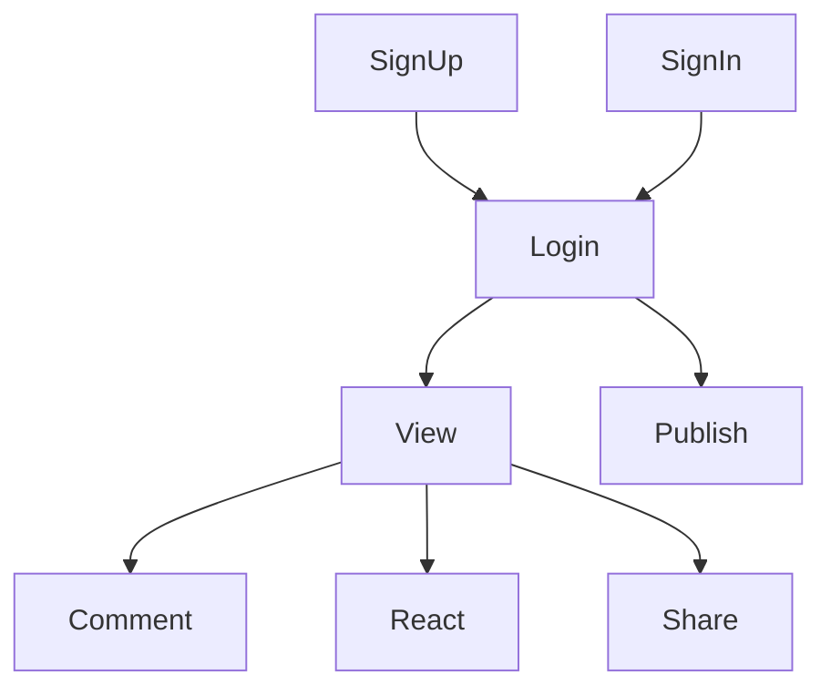
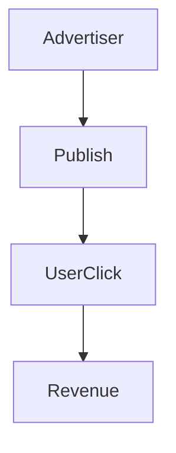

Considering iphone as product. Intitally it had very basic functionality like call and text messages. Browsing and other features were included later on.

Iphone allowed other functionality for seamless user experience.

Mission Statement - What is the company mission statement ?
Product Goal - what value does the product offer to users ?
User journey - what steps does a user take to achieve success ?
Monetization - How does the product generate revenue ?

Mission Statement defines the purpose of a company.

Google -> To organise the world's information and make it universally accessible.
Meta -> To allow people to build community and stay connected
Netflix - to entertain the world

Product Goal should offer value to users.

Considering Meta , it has several products like instagram, facebook, threads..

Further brokendown for example facebook --> groups , messenger, news feed

News feed displays the content, user need not go and search for it, it could be posts, ads..

Clearly understanding product goal would help us to define the main product metric. 

User Journey helps to know what actions a user can perform to reach the product goal.

For example ,

Monetization 

to know the flow on how the product would generate revenue. 

For example , facebook generates revenue with ads..

