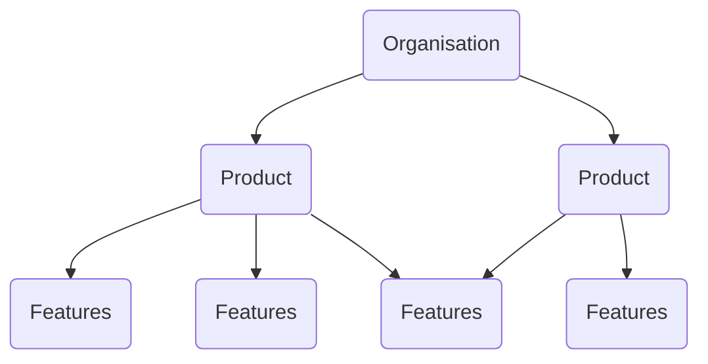

Driver & Secondary Metrics 

Meta as example 

Metas --> core business is Facebook

At the organisation level - it is NSM
At product level it is Driver metrics
At feature level it is secondary metrics 

Driver metrics are the metrics which are focused on product and feature level.
- NSM is the long term focus, Driver metrics are Short term 
- Correlated with NSM
- Often used in experimentations (as the metrics used would give a added value got 1-2 weeks duration)

NSM for Meta --> Total time spent on platform 
Driver metrics --> time spend on NewsFeed & Groups 
Secondary metrics -->  # of views, # of reactions , # of shares (for newsfeed)
                  -->  # of reactions, # of posts (for groups)
                